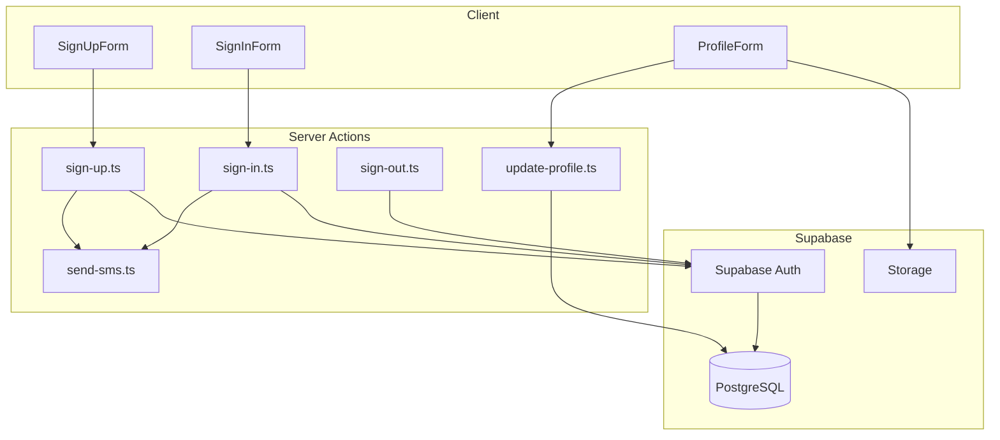

# Design Document: 用户认证体系

## Overview

本设计为川傣餐饮 H5 应用实现基于 Supabase 的用户认证体系。参考 portal-task-web 项目的架构，采用 Server Actions + Supabase Auth 的方式实现。支持手机号+密码登录和手机号+验证码登录两种方式。

## Architecture



### 技术方案

1. **认证服务**: Supabase Auth（支持手机号认证）
2. **数据库**: Supabase PostgreSQL（通过 Prisma ORM）
3. **会话管理**: Supabase 内置会话管理 + Cookie
4. **短信服务**: Supabase 内置 SMS 或第三方服务（阿里云/腾讯云）
5. **表单处理**: React Server Actions + useActionState

## Components and Interfaces

### 1. 目录结构

```
src/
├── features/
│   └── auth/
│       ├── actions/
│       │   ├── sign-up.ts          # 注册
│       │   ├── sign-in.ts          # 密码登录
│       │   ├── sign-in-otp.ts      # 验证码登录
│       │   ├── sign-out.ts         # 登出
│       │   ├── send-otp.ts         # 发送验证码
│       │   └── update-profile.ts   # 更新资料
│       ├── components/
│       │   ├── sign-up-form.tsx
│       │   ├── sign-in-form.tsx
│       │   └── profile-form.tsx
│       ├── queries/
│       │   ├── get-auth.ts
│       │   └── get-user-profile.ts
│       └── hooks/
│           └── use-auth.ts
├── lib/
│   ├── supabase/
│   │   ├── client.ts       # 客户端 Supabase
│   │   └── server.ts       # 服务端 Supabase
│   └── prisma.ts
└── components/
    └── form/
        ├── form.tsx
        ├── field-error.tsx
        ├── submit-button.tsx
        └── utils/
            └── to-action-state.ts
```

### 2. Supabase 客户端配置

```typescript
// src/lib/supabase/server.ts
import { createServerClient } from '@supabase/ssr'
import { cookies } from 'next/headers'

export async function createClient() {
  const cookieStore = await cookies()
  return createServerClient(
    process.env.NEXT_PUBLIC_SUPABASE_URL!,
    process.env.NEXT_PUBLIC_SUPABASE_ANON_KEY!,
    {
      cookies: {
        getAll() {
          return cookieStore.getAll()
        },
        setAll(cookiesToSet) {
          cookiesToSet.forEach(({ name, value, options }) =>
            cookieStore.set(name, value, options)
          )
        },
      },
    }
  )
}
```

### 3. Server Actions 接口

```typescript
// 注册 Action
export async function signUp(
  _actionState: ActionState, 
  formData: FormData
): Promise<ActionState>

// 密码登录 Action
export async function signIn(
  _actionState: ActionState, 
  formData: FormData
): Promise<ActionState>

// 验证码登录 Action
export async function signInWithOtp(
  _actionState: ActionState, 
  formData: FormData
): Promise<ActionState>

// 发送验证码 Action
export async function sendOtp(
  _actionState: ActionState, 
  formData: FormData
): Promise<ActionState>

// 登出 Action
export async function signOut(): Promise<void>
```

## Data Models

### User 数据模型（Prisma Schema）

```prisma
model User {
  id            String    @id @default(uuid()) @db.Uuid
  phone         String    @unique          // 手机号
  passwordHash  String?                    // 密码哈希（验证码登录可为空）
  nickname      String?                    // 昵称
  avatar        String?                    // 头像 URL
  gender        Gender?                    // 性别
  birthday      DateTime?                  // 生日
  bio           String?   @db.VarChar(200) // 个人简介
  createdAt     DateTime  @default(now())  // 创建时间
  updatedAt     DateTime  @updatedAt       // 更新时间
  lastLoginAt   DateTime?                  // 最后登录时间
  
  // Supabase Auth 关联
  authId        String?   @unique @db.Uuid // Supabase Auth User ID
}

enum Gender {
  MALE
  FEMALE
  OTHER
}
```

### 验证 Schema（Zod）

```typescript
// 注册验证
const signUpSchema = z.object({
  phone: z.string()
    .regex(/^1[3-9]\d{9}$/, '请输入有效的手机号'),
  password: z.string()
    .min(6, '密码至少6位')
    .max(20, '密码最多20位'),
  confirmPassword: z.string(),
  code: z.string()
    .length(6, '验证码为6位数字'),
}).refine(data => data.password === data.confirmPassword, {
  message: '两次密码不一致',
  path: ['confirmPassword'],
})

// 密码登录验证
const signInSchema = z.object({
  phone: z.string()
    .regex(/^1[3-9]\d{9}$/, '请输入有效的手机号'),
  password: z.string()
    .min(6, '密码至少6位'),
})

// 验证码登录验证
const signInOtpSchema = z.object({
  phone: z.string()
    .regex(/^1[3-9]\d{9}$/, '请输入有效的手机号'),
  code: z.string()
    .length(6, '验证码为6位数字'),
})
```


## Correctness Properties

*A property is a characteristic or behavior that should hold true across all valid executions of a system-essentially, a formal statement about what the system should do. Properties serve as the bridge between human-readable specifications and machine-verifiable correctness guarantees.*

### Property 1: 注册验证逻辑

*For any* 注册请求，如果两次密码不一致，系统应该返回密码不匹配错误；如果手机号已存在，系统应该返回手机号已注册错误；如果验证码无效，系统应该返回验证码错误。

**Validates: Requirements 1.3, 1.4, 1.5**

### Property 2: 验证码验证逻辑

*For any* 验证码请求，系统应该生成 6 位数字验证码；对于任意错误的验证码输入，系统应该拒绝验证。

**Validates: Requirements 1.1, 1.5, 3.2, 3.4**

### Property 3: 密码登录验证

*For any* 登录请求，如果手机号和密码正确，系统应该创建有效会话；如果凭据错误，系统应该返回错误提示而不泄露具体是手机号还是密码错误。

**Validates: Requirements 2.1, 2.2**

### Property 4: 会话管理一致性

*For any* 用户会话，登录成功后会话应该被安全存储；登出后会话应该被完全清除；会话恢复时应该验证有效性。

**Validates: Requirements 4.1, 5.1, 5.2**

### Property 5: 用户数据模型完整性

*For any* 创建的用户，必须包含手机号、密码哈希、创建时间；可选字段（昵称、头像、性别、生日、简介）应该正确存储；手机号应该是唯一的。

**Validates: Requirements 7.1, 7.2, 7.4**

### Property 6: 资料更新验证

*For any* 资料更新请求，系统应该验证输入数据的有效性；更新成功后查询应该返回更新后的数据。

**Validates: Requirements 6.2**

## Error Handling

| 场景 | 处理方式 |
|------|----------|
| 手机号格式错误 | 返回格式错误提示，不发送请求 |
| 验证码发送失败 | 显示发送失败提示，允许重试 |
| 验证码过期 | 提示验证码已过期，需重新获取 |
| 密码错误 | 统一提示"手机号或密码错误"，防止枚举攻击 |
| 网络错误 | 显示网络错误提示，允许重试 |
| 会话过期 | 自动跳转登录页，提示重新登录 |
| Supabase 服务不可用 | 显示服务暂时不可用提示 |

## Testing Strategy

### 测试框架选择

- **单元测试**: Vitest
- **属性测试**: fast-check
- **组件测试**: @testing-library/react

### 单元测试

1. **Zod Schema 验证测试**
   - 手机号格式验证
   - 密码长度验证
   - 密码匹配验证
   - 验证码格式验证

2. **Server Actions 测试**
   - 注册流程测试（mock Supabase）
   - 登录流程测试
   - 登出流程测试

### 属性测试

每个属性测试配置运行 100 次迭代。

1. **Feature: user-auth-system, Property 1: 注册验证逻辑**
   - 生成随机的不匹配密码对，验证返回错误
   - 生成已存在的手机号，验证返回错误

2. **Feature: user-auth-system, Property 3: 密码登录验证**
   - 生成随机的错误凭据，验证返回统一错误信息

3. **Feature: user-auth-system, Property 5: 用户数据模型完整性**
   - 生成随机用户数据，验证必填字段存在
   - 验证手机号唯一性约束
